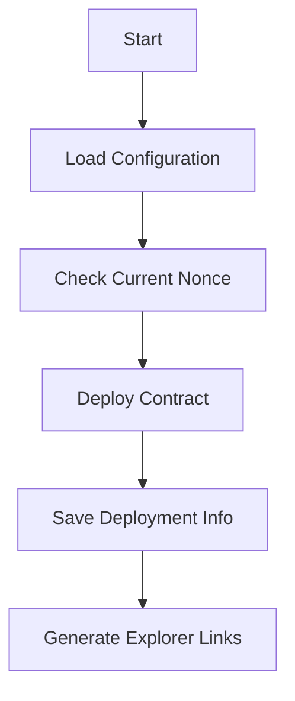

# Script Documentation

## 1. findVanityAddressParallel.js

### Purpose
Generates vanity addresses for smart contracts using parallel processing to speed up the search.

### How it Works
1. Uses Node.js worker threads for parallel processing
2. Each worker:
   - Generates random wallets
   - Calculates potential contract addresses
   - Checks if they match the desired pattern
3. Saves results to vanity-addresses.json

### Code Structure
```javascript
// Main components
- Worker thread setup
- Address generation logic
- Pattern matching
- Result saving
```

### Performance
- Utilizes all CPU cores
- ~1000 addresses/second per core
- Automatic result saving

## 2. checkNonce.js

### Purpose
Monitors account nonce and balance across multiple networks.

### Features
- Multi-network support
- Balance checking
- Nonce verification
- Deployment readiness check

### Network Configuration
```javascript
const networks = {
    'Optimism Sepolia': 'https://sepolia.optimism.io',
    'Base Sepolia': 'https://sepolia.base.org',
    // Add more networks here
};
```

## 3. deployWithNonce.js

### Purpose
Deploys contracts while managing nonce to achieve desired addresses.

### Features
1. **Nonce Management**
   - Tracks current nonce
   - Calculates required nonce
   - Handles deployment sequence

2. **Deployment Tracking**
   - Saves all deployments
   - Records timestamps
   - Stores transaction hashes

3. **Network Support**
   - Multi-network deployment
   - Explorer link generation
   - Network-specific configurations

### Deployment Flow


### Configuration
```javascript
// Example deployment configuration
{
    "contractName": "BTBToken",
    "address": "0x...",
    "deployer": "0x...",
    "deploymentNonce": 1,
    "timestamp": "2025-01-22T..."
}
```

## Common Functions

### Nonce Calculation
```javascript
async function getCurrentNonce(deployer) {
    return await ethers.provider.getTransactionCount(deployer.address);
}
```

### Address Prediction
Contract addresses are calculated using:
```javascript
keccak256(rlp([sender_address, nonce]))
```

## Error Handling

1. **Network Errors**
   - RPC connection failures
   - Network timeouts
   - Invalid responses

2. **Nonce Errors**
   - Nonce too high
   - Nonce mismatch
   - Failed transactions

3. **File System Errors**
   - JSON parsing
   - File writing
   - Permission issues

## Best Practices

1. **Before Deployment**
   - Check network connection
   - Verify account balance
   - Confirm nonce status

2. **During Deployment**
   - Monitor transaction status
   - Wait for confirmations
   - Verify contract creation

3. **After Deployment**
   - Save deployment info
   - Verify contract code
   - Document addresses

## Troubleshooting

Common issues and solutions:

1. **Wrong Contract Address**
   - Check nonce alignment
   - Verify deployer address
   - Confirm bytecode matches

2. **Failed Deployment**
   - Check gas settings
   - Verify network status
   - Confirm account balance

3. **Nonce Mismatch**
   - Reset nonce if needed
   - Check transaction history
   - Verify network state
